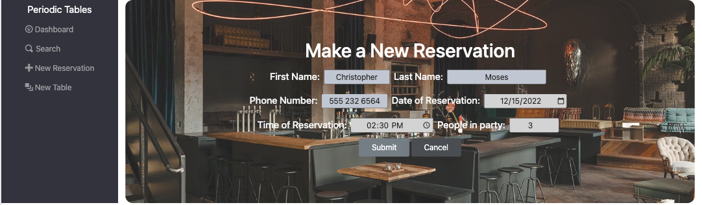

# Periodic Tables Company

## Restaurant Reservation System

> A fictional startup company, wanted an application that is creating a reservation > system for fine dining restaurants. The software is used only by restaurant personnel when a customer calls to request a reservation.

## Nav

- [Video Walkthrough]()
- [File Setup](#files)
- [Database Setup](#database-setup)
- [Installation](#installation)
- [Screenshots](#screenshots)

# Walkthrough

## Files

This repository is set up as a _monorepo_, meaning that the frontend and backend projects are in one repository. This allows you to open both projects in the same editor.

The table below describes the folders in this starter repository:

| Folder/file path | Description                                                      |
| ---------------- | ---------------------------------------------------------------- |
| `./back-end`     | The backend project, which runs on `localhost:5001` by default.  |
| `./front-end`    | The frontend project, which runs on `localhost:3000` by default. |

## Database setup

1. Set up four new ElephantSQL database instances - development, test, preview, and production - by following the instructions in the "PostgreSQL: Creating & Deleting Databases" checkpoint.
1. After setting up your database instances, connect DBeaver to your new database instances by following the instructions in the "PostgreSQL: Installing DBeaver" checkpoint.

## Installation

1. Fork and clone this repository.
1. Run `cp ./back-end/.env.sample ./back-end/.env`.
1. Update the `./back-end/.env` file with the connection URL's to your ElephantSQL database instance.
1. Run `cp ./front-end/.env.sample ./front-end/.env`.
1. You should not need to make changes to the `./front-end/.env` file unless you want to connect to a backend at a location other than `http://localhost:5001`.
1. Run `npm install` to install project dependencies.
1. Run `npm run start:dev` to start your server in development mode.

---

## Screenshots

### New Reservation

Application used for back-of-house only (servers, managers, etc). The new reservations page will allow the customer to call in and have their full name, phone number, date of reservation, time of reservation and party size.

### Create a New Table

This page allows new tables to be created when need be. You must type in the table name and the capacity the table can hold.

### Search for a Reservation

Allows the staff to search for a customer based off of the customers mobile phone number. When it cannot be found it will return not found rather than a phone number.

### Dashboard of all Reservations and Tables

The home screen lists all upcoming, prior, and later on reservations along with tables currently seated, occupied, of finished. All reservations for the current day will be listed at the top.

